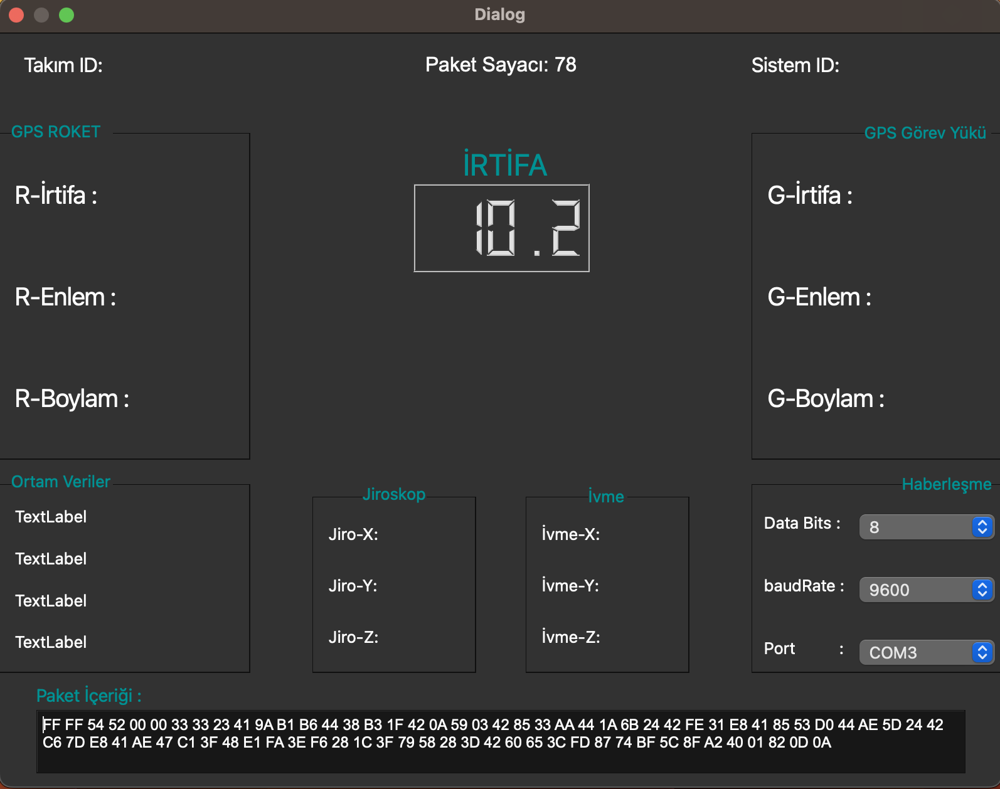

# Roket Takımı Veri İletişim Yazılımı

## Proje Hakkında

Roketlerin fırlatılması ve uçuş sırasında çeşitli verilerin toplanması ve iletilmesi önemlidir. Bu yazılım, fırlatma öncesi hazırlık, roketin uçuşu sırasında veri toplama ve bu verilerin seri bağlantı aracılığıyla bir bilgisayar veya diğer cihazlara iletilmesi için tasarlanmıştır.

## Kullanılan Teknolojiler

- **Arduino**: Roket üzerindeki sensörlerden gelen verileri toplamak için Arduino mikrodenetleyici kullanılmaktadır.
- **C++ ve Qt Creator**: Bilgisayar tarafındaki yazılım, C++ dilinde Qt Creator kullanılarak geliştirilmiştir. Qt Creator, kullanıcı arayüzü oluşturmak ve seri bağlantı ile veri alışverişi yapmak için kullanılmıştır.

## Özellikler

- Roket üzerindeki sensörlerden gelen verilerin toplanması ve paketlenmesi.
- Seri bağlantı aracılığıyla verilerin bir bilgisayara iletilmesi.
- Kullanıcı arayüzü üzerinden alınan verilerin görüntülenmesi.

## Projenin Durumu

Bu proje geliştirme sürecinin tamamını içermemektedir sadece bir örnektir 

  

